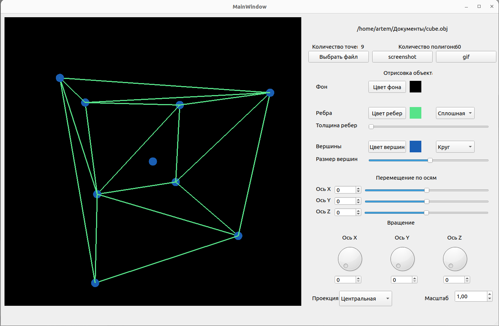

# 3DViewer C++

3DViewer - это программа разработанная на языке C++ для визуализации каркасной модели в трехмерном пространстве.

## Реализация 3DViewer

- Программа разработана на языке C++17 c cоблюдением стандартов оформления кода Google стиле
- Сборка программы настроена с помощью Makefile со стандартным набором целей для GNU-программ;
- Обеспечено покрытие unit-тестами c помощью библиотеки GTest;
- Реализация с графическим пользовательским интерфейсом -Qt;
- Программа реализована с использованием паттерна MVC;

## Функционал

- В один момент времени должна быть только одна модель на экране;
- Программа предоставляет возможность:
    - Загружать каркасную модель из файла формата obj (поддержка только списка вершин и поверхностей);
    - Перемещать модель на заданное расстояние относительно осей X, Y, Z;
    - Поворачивать модель на заданный угол относительно своих осей X, Y, Z;
    - Масштабировать модель на заданное значение;
- Графический пользовательский интерфейс содержит:
    - Кнопку для выбора файла с моделью и поле для вывода его названия;
    - Зону визуализации каркасной модели;
    - Кнопку/кнопки и поля ввода для перемещения модели;
    - Кнопку/кнопки и поля ввода для поворота модели;
    - Кнопку/кнопки и поля ввода для масштабирования модели; 
    - Информацию о загруженной модели - название файла, кол-во вершин и ребер;
- Программа позволяет настраивать тип проекции (параллельная и центральная);
- Программа позволяет настраивать тип (сплошная, пунктирная), цвет и толщину ребер, способ отображения (отсутствует, круг, квадрат), цвет и размер вершин;
- Программа позволяет выбирать цвет фона;
- Программа позволяет сохранять полученные («отрендеренные») изображения в файл в форматах bmp и jpeg;
- Программа позволяет по специальной кнопке записывать небольшие «скринкасты» - текущие пользовательские аффинные преобразования загруженного объекта в gif-анимацию (640x480, 10fps, 5s).

## Требования к установке

Для установки и сборки проекта требуется следующее:
- qmake6
- Компилятор gcc
- make

## Установка

- Откройте терминал и перейдите в директорию проекта src
- Введите команду:
`make install`

## Удаление 
- Откройте терминал и перейдите в директорию проекта src
- Введите команду: 
`make uninstall`